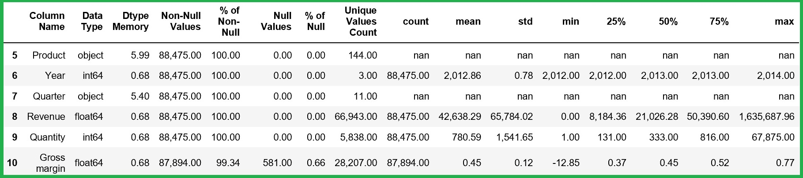

# TidyData
How to use Python to understand data and transform the data into a tidy format ready to be used for modelling and visualisation.

**Objective** 
The main objective of this notebook is only to understand and explore the raw data. The code is largely kept generic so that it could be used with any shape of data. Any data quality or data tidying recommendations or decisions specific to the sample data set are not documented in this notebook to maintain clarity and keep the focus only in data exploration.  
Any data quality or data tidying recommendations or decisions specific to the sample data set will be dealt in follow up notebooks in this series. The reason for seperating these into several notebooks is to maintain clarity and simplicity in each step of the data preparation journey.

# The Game Changer  
The game changer for data quaity analysis is the final ***Data Qaulity Dataframe*** that is generated which combines ***all*** the information required to inform data cleaning, tidy data and optimisations (memory and processing) decions.  
Instead of using variuos pandas commands at different instances and going back and forth to cross refer information, Data Quality Dataframe brings all information into a single dataframe. This can then be used to generate data quality related information and plotting to understand data. 

Understanding the data is **the critical step** in preparaing the data to be used for analytics. As many experts will point out the data preparation and tranforming the data into a tidy format takes about 80% of the effort in any data analytics or data anlysis project. 
Understanding the data requires good understanding of the domain and/or access to a subject matter expert (SME) to help make decions about data quality and data usage:
* how to interpret each columns and possible values of a column?
* should teh columns be renamed (and cleaned e.g. trim)?
* can any columns be discarded that may not be required for analytics?
* can duplicate columns be dropped?
* can columns with no values (or all empty) be dropped?
* can the missing values be filled and can it be filled meaningfuly?
* can rows that have missing values for certain columns or combination of columns be dropped?
* can columns which have more than certain threshold of blank values be dropped?
    - based on percentage of null values
* can numeric column data types converted / down casted to optimise memory usage based on the data values (or will there be outliers possibly in future data sets that we cannot do this)?
    - use the min and max values to determine the lowest possible data type
* can some columns be converted to Category types?
    - based on count of unique values

