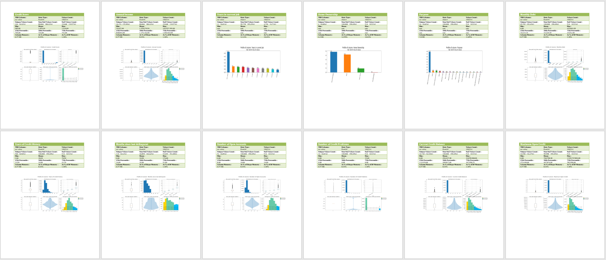

# Pandas Data Exploration Journey
The Pandas Data Exploration Journey series will consist of following notebooks :
1. Data Profiling (01_12_av_automated_data_profiling.ipynb)
2. Data Quality and Transformations Decisions
3. Tidy Data and Data Tranformations  
4. Analytics & Visualisations

## Objective
The main objective of this notebook is only to understand the data using Data Profiling.  ***The output is a MS Woprd document which documents all the data profiling infoprmation and plots for the given data file.***
The code is largely kept generic so that it could be used with any shape of data. Any data quality or data tidying recommendations will be dealt in other notebooks.  

# Data Profile Dataframe (DPD) - The Game Changer  
The game changer for exploratory data analysis is the final ***Data Profile Dataframe*** that is generated which combines ***all*** the information required to inform data cleaning, tidy data and optimisations (memory and processing) decisions.  
Instead of using various Pandas commands at different instances and going back and forth to cross refer information, Data Profile Dataframe brings all information into a single dataframe. This will be very useful when reviewing the data profile with the business subject matter or other team members as all information related to data profile is in a single easy to understand format.

Understanding the data is **the critical step** in preparing the data to be used for analytics. As many experts will point out the data preparation and transforming the data into a tidy format takes about 80% of the effort in any data analytics or data analysis project. 
***Understanding the data requires good understanding of the domain and/or access to a subject matter expert (SME) to help make decisions about data quality and data usage:***
* What are the columns and what do they mean?
* How to interpret each columns and possible values of a column?
* Should the columns be renamed (and cleaned e.g. trim)?
* Are there columns that may have similar information that could be dropped in favour of one master column?
* Can columns with no values (or all empty) be dropped?
* Can columns which have more than certain threshold of blank values be dropped?
* How can the missing values be filled and can it be filled meaningfully?
* Can rows that have missing values for certain columns or combination of columns be dropped? i.e. the row is meaningless wihtout those values.
* Can the numeric data type columns be converted / down casted to optimise memory usage based on the data values?
    - or will there be outliers possibly in future data sets that we cannot do this?
    - can the min and max values be used to determine the lowest possible data type?
* Can some string/object columns be converted to Category types?
    - based on count of unique values
* Can any columns be discarded that may not be required for analytics?
